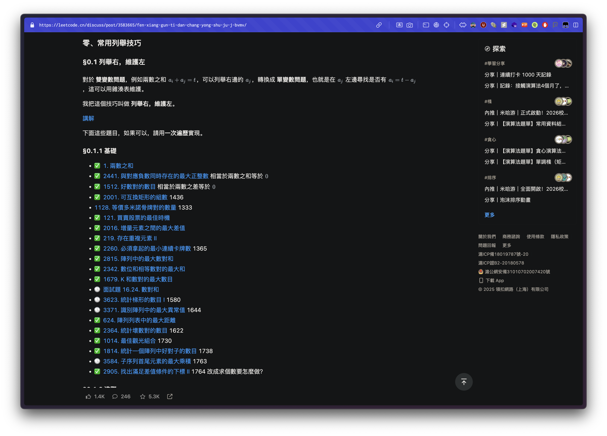

# LeetCode Problem Status Marker (International)

A UserScript that displays your **International LeetCode** problem solving status on **Chinese LeetCode** problem list pages.



*Example: Status icons displayed next to problem links*

## Features

- 🔍 **Automatic Detection**: Scans problem links on Chinese LeetCode pages
- ✅ **Visual Status Indicators**: Shows clear icons for problem status
  - ✅ Solved (Accepted)
  - ❌ Attempted but not solved
  - 🕓 Not attempted
  - ❓ Unknown status
- 🚀 **Smart Fetching**: Uses batch mode for large lists and single requests for small lists
- 🔄 **Real-time Updates**: Monitors page changes for SPA applications
- 🛡️ **CSRF Protection**: Automatically handles authentication tokens

## Prerequisites

1. **Browser Extension**: Install a UserScript manager
   - [Tampermonkey](https://www.tampermonkey.net/) (Recommended)
   - [Greasemonkey](https://www.greasespot.net/) (Firefox)
   - [Violentmonkey](https://violentmonkey.github.io/)

2. **Browser Configuration**:
   - **Enable Developer Mode** in your UserScript manager
   - Allow cross-origin requests (usually enabled by default in UserScript managers)

3. **Account Requirements**:
   - Active account on [LeetCode International](https://leetcode.com/)
   - Logged in to both Chinese and International versions

## Installation

1. **Install UserScript Manager**: Download and install [Tampermonkey](https://www.tampermonkey.net/) (recommended)

2. **Enable Developer Mode**: 
   - Open Tampermonkey dashboard
   - Go to Settings tab
   - Set Config mode to "Advanced" or "Expert"
   - Ensure "Allow scripts to access cross-origin resources" is enabled

3. **Install the Script**:
   - Click [here to install the script](link-to-your-userscript) or
   - Copy the script code manually into Tampermonkey

4. **Verify Installation**:
   - The script should appear in your Tampermonkey dashboard
   - Make sure it's enabled (green indicator)
   - The script will automatically activate on Chinese LeetCode pages

## Usage

1. Visit any Chinese LeetCode discussion post with problem links:
   - `https://leetcode.cn/discuss/post/*`

2. The script will automatically:
   - Detect problem links on the page
   - Fetch your solving status from International LeetCode
   - Display status icons next to each problem link


*Before and after: Problem links with status indicators*

## How It Works

### Intelligent Fetching Strategy

- **Small Lists (≤10 problems)**: Individual API calls for each problem
- **Large Lists (>10 problems)**: Single batch GraphQL query for all problems

### Status Mapping

| International Status | Icon | Description |
|---------------------|------|-------------|
| `Accepted` | ✅ | Successfully solved |
| `Attempted` | ❌ | Tried but not solved |
| `NotStarted` | 🕓 | Never attempted |
| Unknown | ❓ | Status unavailable |

### API Integration

The script uses LeetCode's GraphQL API:
- **Batch Query**: `getQuestionsByTag` operation
- **Single Query**: `questionData` operation
- **Authentication**: Automatic CSRF token handling

## Troubleshooting

### Common Issues

**Script not working?**
- Ensure you're logged in to LeetCode International
- **Check Tampermonkey settings**: Make sure Config mode is set to "Advanced" or "Expert"
- **Verify cross-origin permissions**: Ensure "Allow scripts to access cross-origin resources" is enabled
- Check browser console for error messages
- Try refreshing the page

**Status not updating?**
- Clear browser cache
- Re-login to LeetCode International
- Check if UserScript manager is enabled

**CSRF Token warnings?**
- Make sure you're logged in to LeetCode International
- The script will still work but may have limited functionality

### Debug Information

The script provides console logging:
```
🚀 [Chinese Problem List - International Status] Script started
🔍 Detected X problem links
📦 Batch mode: Successfully fetched statuses for X problems
```

## Configuration

### Customizable Threshold

You can modify the threshold for batch vs single mode:

```javascript
const THRESHOLD = 10; // Change this value as needed
```

### Custom Status Icons

Modify the `getStatusIcon` function to use different icons:

```javascript
function getStatusIcon(status) {
    switch (status) {
        case 'Accepted': return '✅'; // Your custom icon
        // ... other cases
    }
}
```

## Limitations

- Only works on Chinese LeetCode discussion pages (`leetcode.cn/discuss/post/*`)
- Requires active login on International LeetCode
- Rate limited by LeetCode's API restrictions
- May not work if LeetCode changes their API structure

## Contributing

1. Fork the repository
2. Create a feature branch
3. Make your changes
4. Test thoroughly
5. Submit a pull request

## License

MIT License - see LICENSE file for details

## Changelog

### Version 0.1
- Initial release
- Basic status fetching and display
- Batch and single request modes
- CSRF token handling

## Support

If you encounter issues:
1. Check the troubleshooting section
2. Look at browser console logs
3. Create an issue with detailed information

## Acknowledgments

- Thanks to the LeetCode community
- Inspired by the need to sync progress between platforms

---

**Note**: This is an unofficial tool and is not affiliated with LeetCode. Use responsibly and in accordance with LeetCode's terms of service.